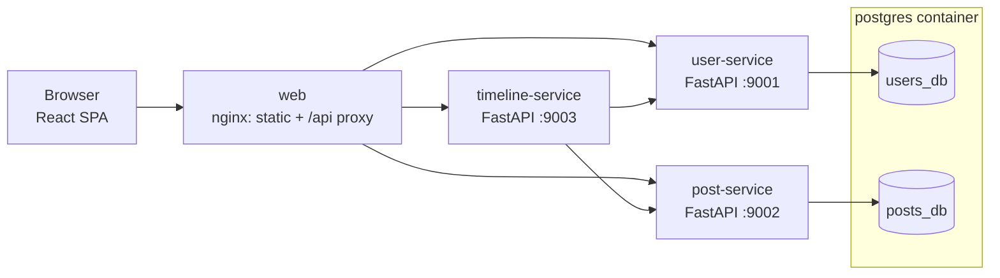

# MyOwnX — High-Level Design

**Version:** 1.0 · **Date:** 2026-07-06 · **Related:** [prd.md](prd.md)

## 1. Architecture overview



Four services plus one Postgres container, orchestrated by docker compose.
Services communicate over the compose network via HTTP only — no shared
volumes, no shared tables.

## 2. Services

| Service | Responsibility | Owns data | Port |
|---|---|---|---|
| `web` | Serves the React build; reverse-proxies `/api/*` to backend services (single origin → no CORS) | — | 3000 |
| `user-service` | Accounts, auth (JWT issuing), profiles, follow graph | `users_db` | 9001 |
| `post-service` | Posts, replies, likes, post full-text search | `posts_db` | 9002 |
| `timeline-service` | Read-side aggregation: home timeline & unified search (fans out to user/post services, merges results) | stateless | 9003 |

**Why a stateless timeline-service?** Timeline is a *composition* concern:
it needs the follow graph (user-service) and posts (post-service). Putting
it in either service would couple them; a thin aggregator keeps ownership
clean and gives us a natural place for caching later.

## 3. Data model

### users_db (owned by user-service)

```
users    (id PK, username UNIQUE, display_name, password_hash,
          bio, created_at)
follows  (follower_id FK→users, followee_id FK→users,
          created_at, PK (follower_id, followee_id))
```

### posts_db (owned by post-service)

```
posts  (id PK, author_id BIGINT,          -- user id, NOT a FK (other service)
        text VARCHAR(280), reply_to_id FK→posts NULL,
        created_at, search_vector tsvector)
likes  (user_id BIGINT, post_id FK→posts, created_at,
        PK (user_id, post_id))
```

`author_id` / `user_id` are plain integers — cross-service references are
by ID only; integrity across services is by API contract, not FK.

**Indexes (performance):**
- `posts (author_id, created_at DESC)` — profile pages & timeline fan-in
- `posts (reply_to_id)` — thread lookups
- `GIN (search_vector)` — full-text search
- `follows (follower_id)` — "who do I follow" (timeline)
- `follows (followee_id)` — follower counts

## 4. API design

Public endpoints (via `web` proxy under `/api`):

| Method & path | Service | Purpose |
|---|---|---|
| `POST /api/users/signup`, `POST /api/users/login` | user | Register / get JWT |
| `GET /api/users/{username}` | user | Profile + follower/following counts |
| `POST/DELETE /api/users/{username}/follow` | user | Follow / unfollow |
| `GET /api/users/me` | user | Current user |
| `POST /api/posts` | post | Create post / reply (`reply_to_id` optional) |
| `DELETE /api/posts/{id}` | post | Delete own post |
| `GET /api/posts/{id}` | post | Post + replies (thread view) |
| `POST/DELETE /api/posts/{id}/like` | post | Like / unlike |
| `GET /api/timeline?cursor=&limit=` | timeline | Home timeline (auth) |
| `GET /api/timeline/user/{username}` | timeline | Profile timeline |
| `GET /api/search?q=&type=posts\|users` | timeline | Unified search |

Internal endpoints (service-to-service, compose network only):

| Method & path | Service | Consumer |
|---|---|---|
| `GET /internal/users?ids=1,2,3` | user | timeline (batch author hydration) |
| `GET /internal/users/{id}/following-ids` | user | timeline |
| `GET /internal/posts?author_ids=&cursor=&limit=` | post | timeline |
| `GET /internal/posts/search?q=` | post | timeline |
| `GET /internal/users/search?q=` | user | timeline |

### Timeline read path (no N+1)

```
GET /api/timeline
  1. user-service:  GET /internal/users/{me}/following-ids     (1 call)
  2. post-service:  GET /internal/posts?author_ids=...&cursor  (1 call, indexed)
  3. user-service:  GET /internal/users?ids=<distinct authors> (1 call)
  → merge, return posts hydrated with author + like info
```

Exactly **3 internal calls** per timeline page regardless of page size.
Pagination is cursor-based (`created_at,id` keyset) — stable under inserts
and cheaper than OFFSET.

## 5. Auth flow

- `user-service` issues **JWT (HS256)** on login; secret shared via env var.
- Every service verifies tokens **locally** — no per-request call to
  user-service, so auth never becomes a bottleneck.
- Trade-off: HS256 shared secret is fine for a demo; production would use
  RS256 (auth holds the private key, others verify with the public key).

## 6. Migrations

Each data-owning service has its **own Alembic environment** and version
history (`services/<name>/migrations/`). Every migration implements both
`upgrade()` and `downgrade()` — verified in CI by running
`upgrade head → downgrade base → upgrade head`.

Postgres bootstrap: an init script (mounted into the postgres container
only) creates one database + one role per service; each role can only
access its own database.

## 7. Repository layout

```
myownx/
├── docs/                  # prd.md, hld.md
├── services/
│   ├── user-service/      # app/, migrations/, tests/, Dockerfile
│   ├── post-service/      # app/, migrations/, tests/, Dockerfile
│   └── timeline-service/  # app/, tests/, Dockerfile
├── web/                   # React + Vite SPA, nginx.conf, Dockerfile
├── shared/                # cross-service assets: postgres init, .env
├── data/                  # runtime data (postgres volume) — gitignored
├── .github/workflows/     # ci.yml
├── docker-compose.yml
└── README.md
```

Naming convention: **lowercase-kebab-case** for all files and folders;
ecosystem-standard names (`Dockerfile`, `README.md`) keep their canonical
form. Each service is fully self-contained (own deps, own image) — the
small duplication of JWT-verification code between services is deliberate,
preserving independent deployability.

## 8. Tech stack

| Layer | Choice |
|---|---|
| API services | Python 3.12, FastAPI, SQLAlchemy 2 (async), asyncpg |
| Migrations | Alembic (per service) |
| Auth | PyJWT, bcrypt |
| Frontend | React 18, Vite, vanilla CSS (custom design system) |
| Infra | Docker Compose, nginx, PostgreSQL 16 |
| CI | GitHub Actions: ruff (lint), pytest, migration round-trip, file-size guard |

## 9. Key design decisions

| # | Decision | Rationale |
|---|---|---|
| D1 | One Postgres container, logical DB + role per service | Physically enforces API-only communication at 1/4 the container cost |
| D2 | Stateless timeline aggregator | Clean ownership; composition point for caching; no data duplication |
| D3 | Local JWT verification (HS256) | No auth round-trip per request → performance |
| D4 | Cursor (keyset) pagination | Stable + fast at any depth, unlike OFFSET |
| D5 | Postgres full-text search (tsvector + GIN) | Real search quality with zero extra infrastructure |
| D6 | Single-origin nginx proxy | No CORS complexity, one URL for the demo, prod-like edge |
